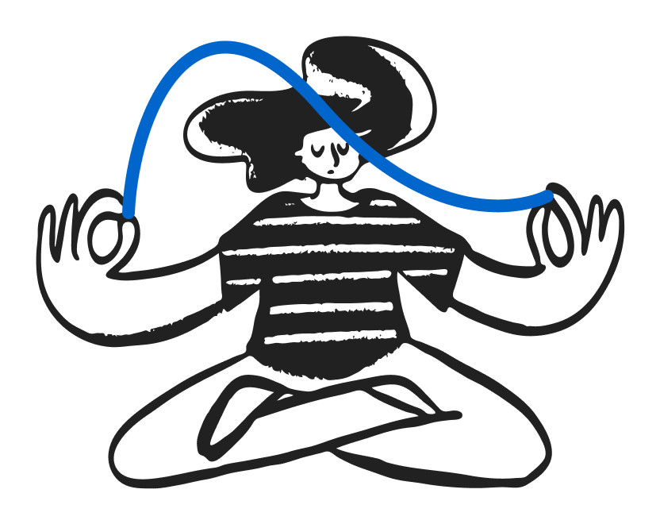

# MCP server per il Design system .italia

*Non perdere il filo.*



> ⚠️ **Progetto personale non ufficiale e sperimentale** - I dati sono forniti così come sono e potrebbero essere incompleti o non aggiornati. Utilizzare a proprio rischio. / ⚠️ **Unofficial & experimental personal sandbox project** - Data is provided as-is and may be outdated or incomplete. Use at your own risk.

[](https://deepwiki.com/fupete/design-system-italia-mcp) [](LICENSE)

---

## Di cosa parliamo? / What are we talking about?

**IT** — Design system .italia è il sistema open source ufficiale per realizzare le interfacce della Pubblica Amministrazione. Una iniziativa del progetto [Designers Italia](https://designers.italia.it/), è distribuito in più repository indipendenti.

**EN** — Design System .italia is the official open source design system for Italian Public Administration interfaces. An initiative by [Designers Italia](https://designers.italia.it/), it is distributed across multiple independent repositories.

- [Bootstrap Italia](https://github.com/italia/bootstrap-italia) — componenti e stili HTML/CSS / HTML/CSS components and styles ⚠️ v3 beta
- [Dev Kit Italia](https://github.com/italia/dev-kit-italia) — web component `it-*` ⚠️ v1 beta
- [Design Tokens Italia](https://github.com/italia/design-tokens-italia) — variabili CSS e SCSS globali `--it-*` e `$it-` / global CSS and SCSS variables
- [designers.italia.it](https://designers.italia.it/design-system/) — documentazione e linee guida d'uso / documentation and usage guidelines

---

## Cos'è Filo / What is Filo

**IT** — Filo è un server MCP (Model Context Protocol) non ufficiale che espone a assistenti AI i dati strutturati del Design system .italia: componenti e markup HTML Bootstrap Italia v3 ⚠️ beta, web component e props Dev Kit Italia v1 ⚠️ beta, token CSS con valori risolti, linee guida per componente, stato di accessibilità e issue GitHub collegate. I dati sono aggiornati nightly tramite snapshot CI nel branch `data-fetched`.

**EN** — Filo is an unofficial MCP (Model Context Protocol) server providing AI assistants with structured access to Italy's Design System resources: Bootstrap Italia v3 components and HTML markup ⚠️ beta, Dev Kit Italia web components and props v1 ⚠️ beta, CSS tokens with resolved values, per-component usage guidelines, accessibility status, and related GitHub issues. Data is refreshed nightly via CI snapshot into the `data-fetched` branch.

---

## Perché Filo / Why Filo

**IT** — Tenere il filo della qualità nell’epoca degli LLM e dell’AI come scorciatoia per tutto. Rendere interrogabile il Design system .italia e il suo vasto ecosistema di risorse. Supportare persone e assistenti AI nella progettazione, esplorazione, generazione e validazione su dati reali e verificati. Un server MCP read-only e open source. Un esperimento sulle possibilità di sviluppare software utile per le persone, anche mentre litighi con qualche LLM.

**EN** — Keep the thread of quality in the age of LLMs and AI as a shortcut for everything. Make Italy’s Design System and its vast ecosystem of resources queryable. Support people and AI assistants in design, exploration, code generation and validation — on real, verified data. A read-only, open source MCP server. An experiment in the possibilities of building software that is actually useful for people, even while arguing with a few LLMs.​​​​​​​​​​​​​​​​

---

## Strumenti disponibili / Available tools

I tool sono organizzati per sorgente/namespace: `dsi_` (inventario unificato componenti Design system .italia), `bsi_` e `devkit_` (markup/varianti/props da Bootstrap Italia e Dev Kit Italia — mirror solo dove le sorgenti producono artefatti distinti), `tokens_` (design token e variabili CSS, asse sorgente unico), `docs_` (da schede linee guida Designers Italia), `github_` (issue dalle repo dell'ecosistema). Rispetto alle prime release, per un approccio di risparmio token, non esiste più un tool aggregatore `full`: combinare più fonti in un'unica risposta è responsabilità del client, componendo più chiamate mirate. 

### Componenti — `dsi_`
- `dsi_list_components()` — inventario unificato di tutti i componenti: una riga per componente con `bsi:{status, accessibility}` (`null` se non presente in Bootstrap Italia) e `devkit:{tags, storybookUrl, componentType}` (`null` se non presente in Dev Kit Italia). Un componente è un'unica entità con due possibili implementazioni. Punto di partenza prima di markup, token o props.
- `dsi_search_components(query)` — ricerca sulla stessa unione, per nome, slug, alias IT/EN o tag Dev Kit.

### Markup e varianti — `bsi_` / `devkit_`
- `bsi_list_component_variants(component)` — nomi di tutte le varianti Bootstrap Italia disponibili, senza markup.
- `bsi_get_component_markup(component, variant?)` — markup HTML completo di una variante specifica (`variant` omesso → prima variante).
- `bsi_list_components_by_status(status)` — componenti Bootstrap Italia filtrati per stato di implementazione (PRONTO, DA RIVEDERE, DA FARE, ...).
- `devkit_list_component_variants(component)` — nomi di tutte le varianti Dev Kit Italia disponibili.
- `devkit_get_component_markup(component, variant?)` — markup HTML di una variante Dev Kit, estratto da Storybook via snapshot CI (`variant` omesso → prima variante).
- `devkit_list_component_props(component)` — attributi HTML `it-*` di un web component Dev Kit: nome, tipo, descrizione, default, opzioni — incluse le props dei subcomponenti (es. `it-accordion-item`).

### Design tokens e variabili CSS — `tokens_`
- `tokens_list_component_vars(component)` — variabili CSS `--bsi-*` personalizzabili di un componente, con descrizione semantica, catena di risoluzione e valore risolto.
- `tokens_list_globals(match?)` — coppie di token globali che Bootstrap Italia usa davvero: Design Token centrale (`--it-*`/`$it-*`, non sovrascrivibile per progetto) + `--bsi-*` corrispondente (sovrascrivibile a runtime), con valore risolto. `match` filtra per sottostringa nel nome, omesso restituisce tutti.
- `tokens_resolve(variable)` — risolve qualunque variabile (`--bsi-*`, `--it-*` o `$it-*`) al valore concreto, seguendo l'intera catena.
- `tokens_find_components(variable)` — componenti Bootstrap Italia impattati da una variabile, incluso l'impatto indiretto tracciato lungo la catena. Utile per capire cosa cambia sovrascrivendo una variabile.
- `tokens_search(query)` — ricerca per sottostringa nel nome della variabile, su token BSI e Design Tokens Italia globali.

Ogni token include `resolvedVia`: l'elenco degli hop intermedi della catena di risoluzione, ciascuno con `role` (`bsi-component` | `bsi-global` | `dti`) e `overridable` (`true` per le `--bsi-*` sovrascrivibili a runtime, `false` per i Design Token centrali `--it-*`/`$it-*`, definiti upstream).

### Linee guida componenti e stato accessibilità — `docs_`
- `docs_get_component_guide(component)` — linee guida d'uso da Designers Italia: descrizione, quando/come usarlo, stato verifiche accessibilità, stato libreria (Bootstrap Italia, UI Kit Italia, Dev Kit Italia). Lo stato accessibilità per-componente è disponibile anche in `dsi_list_components` (campo `bsi.accessibility`).

### Issue e stato progetto — `github_`
- `github_get_component_issues(component)` — issue GitHub aperte per componente sulle repository monitorate (bootstrap-italia, design-ui-kit, dev-kit-italia, design-tokens-italia), più le issue note già registrate in `components_status.json`.
- `github_get_project_repo_links()` — link alle issue aperte di ciascuna repository. Non include i dati live delle board GitHub Projects v2 (non ancora integrate).

### Connessione e meta
- `ping` — verifica connessione al server, versione, timestamp e warning sulle sorgenti in beta. Da usare all'inizio della sessione per confermare i tool disponibili.

---

## Query consigliata / Recommended Query

Il valore del server è la **combinazione contestuale** di sorgenti frammentate — componendo più chiamate mirate.

Esempi: *"Quali varianti ha l'Accordion e quali token posso personalizzare?"*, *"Quali variabili devo sovrascrivere nel mio CSS per cambiare i colori di header e footer?"*, *"..."*

Flusso tipico: `dsi_list_components`/`dsi_search_components` per orientarsi → `bsi_list_component_variants`/`devkit_list_component_variants` per i nomi delle varianti → `bsi_get_component_markup`/`devkit_get_component_markup` per il markup di una variante specifica → `tokens_list_component_vars`/`tokens_resolve` per i token.

Ogni risposta include le versioni delle risorse (Design system .italia, Bootstrap Italia, Dev Kit Italia, Design Tokens Italia), URL verificato della documentazione ufficiale e `dataFetchedAt`, la data dell'ultimo snapshot CI che avviene tendenzialmente* ogni notte, non il momento della richiesta. (* = laddove ci sono rilasci di nuove versioni upstream).

I tool `bsi_get_component_markup`/`devkit_get_component_markup` restituiscono sempre una sola variante per chiamata; usa prima `bsi_list_component_variants`/`devkit_list_component_variants` per scoprire i nomi delle varianti disponibili.

I nomi dei componenti funzionano in italiano e inglese: *"fisarmonica"*, *"dialog"*, *"pulsante"* trovano accordion, modal, button.

---

## System prompt consigliato / Recommended system prompt

Per ridurre gli errori o allucinazioni, istruisci il tuo assistente AI a basarsi esclusivamente sui dati restituiti da Filo.

**IT**
```
## Regole dati Design System .italia (Filo MCP)

DATI VERIFICATI: usa esclusivamente i dati restituiti dagli strumenti MCP di Filo. Non integrare con conoscenza pregressa su Bootstrap Italia, Dev Kit Italia, Design Tokens Italia o altri framework CSS/web component.

QUANDO IL DATO MANCA: se un'informazione non è presente nelle risposte MCP, dillo esplicitamente. Scrivi "Questo dato non è disponibile nelle sorgenti MCP" anziché fornire una stima o inferenza. Non inventare valori numerici.

QUANDO COMPONI ELEMENTI: se combini markup MCP reale con HTML/CSS che aggiungi tu, segnala chiaramente cosa viene dai dati MCP e cosa è tua inferenza.

VERSIONI E FONTI: in ogni risposta che usa dati MCP, includi la versione delle sorgenti e il link alla documentazione ufficiale restituiti dal tool.

REGOLA D'ORO: se non sei sicuro che un dato provenga da MCP, trattalo come inferenza e segnalalo.

TOOL DISPONIBILI: all'inizio della sessione, usa il tool ping per verificare la connessione e leggi la lista dei tool disponibili. Non assumere quali tool esistono.

COMPLETEZZA DATI: se un componente non è presente in una sorgente (es. `devkit: null` in dsi_list_components/dsi_search_components), segnalalo all'utente invece di presumerne l'assenza totale.
```

**EN**
```
## Data rules — Design System .italia (Filo MCP)

VERIFIED DATA: use exclusively the data returned by Filo's MCP tools. Do not supplement with prior knowledge of Bootstrap Italia, Dev Kit Italia, Design Tokens Italia, or any other CSS/web component framework.

WHEN DATA IS MISSING: if information is not present in the MCP responses, say so explicitly. Never invent numeric values.

WHEN COMPOSING ELEMENTS: clearly indicate what comes from MCP data and what is your own inference.

VERSIONS AND SOURCES: in every response that uses MCP data, include the source versions and official documentation URL returned by the tool.

GOLDEN RULE: if you are unsure whether a piece of data comes from MCP, treat it as inference and label it as such.

AVAILABLE TOOLS: at the start of the session, use the ping tool to verify the connection and read the list of available tools. Do not assume which tools exist.

DATA COMPLETENESS: if a component is missing from one source (e.g. `devkit: null` in dsi_list_components/dsi_search_components), flag this to the user instead of assuming it doesn't exist at all.
```

---

## Come connettersi / How to connect

### Claude Desktop / Cursor / VS Code (via NPX — consigliato)

Non richiede installazione — npx scarica e avvia il server automaticamente.

Aggiungi al file di configurazione MCP del tuo client:
```json
{
  "mcpServers": {
    "design-system-italia": {
      "command": "npx",
      "args": ["-y", "@fupete/design-system-italia-mcp"],
      "env": {
        "TRANSPORT": "stdio",
        "GITHUB_TOKEN": "your_token_here"
      }
    }
  }
}
```

> ℹ️ **nvm su macOS** — se `npx` risolve a una versione vecchia di Node ("You must supply a command" o "Cannot find module 'node:path'"), usa il path esplicito. Trova il path con `nvm use 22 && which npx`, poi:
> ```json
> {
>   "mcpServers": {
>     "design-system-italia": {
>       "command": "/Users/tuonome/.nvm/versions/node/v22.12.0/bin/npx",
>       "args": ["-y", "@fupete/design-system-italia-mcp"],
>       "env": {
>         "PATH": "/Users/tuonome/.nvm/versions/node/v22.12.0/bin:/usr/local/bin:/usr/bin:/bin",
>         "TRANSPORT": "stdio",
>         "GITHUB_TOKEN": "your_token_here"
>       }
>     }
>   }
> }
> ```
> Sostituisci `tuonome` e `v22.12.0` con i tuoi valori.

#### Oppure via CLI (Claude Desktop):
```bash
claude mcp add design-system-italia \
  --command "npx -y @fupete/design-system-italia-mcp" \
  --env TRANSPORT=stdio \
  --env GITHUB_TOKEN=your_token
```

> ℹ️ **Problemi con nvm su macOS?** Usa la configurazione JSON sopra con path esplicito.

### Self-hosting con Docker (locale o VPS)

Funziona su qualsiasi macchina con Docker installato — locale, VPS personale, server aziendale.

```bash
docker pull ghcr.io/fupete/design-system-italia-mcp
docker run -e GITHUB_TOKEN=your_token -p 8080:8080 \
  ghcr.io/fupete/design-system-italia-mcp
```

> ⚠️ **Docker multiarch** — se `docker pull` scarica un'architettura incompatibile,
> fai una build locale: `docker build -t design-system-italia-mcp .`

> ℹ️ **`GITHUB_TOKEN` (opzionale ma consigliato)** — serve per il tool `github_get_component_issues`.
> Senza token: 60 richieste/ora per IP. Con token: 5000 richieste/ora.
> Basta un token con scope pubblico read-only — nessun permesso speciale richiesto.

---

## Sorgenti dati / Data sources

I dati sono aggiornati nightly tramite CI snapshot e serviti dal branch [`data-fetched`](https://github.com/Fupete/design-system-italia-mcp/tree/data-fetched). Solo le GitHub Issues sono fetchate live a runtime.

| # | Repo | Contenuto | Tool MCP |
|---|------|-----------|----------|
| 1 | [bootstrap-italia](https://github.com/italia/bootstrap-italia) | Markup HTML varianti per componente | `bsi_get_component_markup` `bsi_list_component_variants` |
| 2 | [bootstrap-italia](https://github.com/italia/bootstrap-italia) | Lista ~55 componenti, stato librerie (BSI/UI Kit), accessibilità, note issue | `dsi_list_components` `dsi_search_components` `bsi_list_components_by_status` |
| 3 | [bootstrap-italia](https://github.com/italia/bootstrap-italia) | Token CSS `--bsi-*` per-componente con descrizioni semantiche | `tokens_list_component_vars` `tokens_search` `tokens_find_components` |
| 4 | [bootstrap-italia](https://github.com/italia/bootstrap-italia) | Bridge `--bsi-*` → `--it-*` (token resolution) | `tokens_list_globals` `tokens_resolve` `tokens_find_components` |
| 5 | [designers.italia.it](https://github.com/italia/designers.italia.it) | Linee guida d'uso, accessibilità, quando/come usare | `docs_get_component_guide` |
| 6 | [design-tokens-italia](https://github.com/italia/design-tokens-italia) | Token globali `--it-*`/`$it-*` con valori concreti. Risolve `var(--bsi-spacing-m)` → `1.5rem` | `tokens_list_globals` `tokens_resolve` `tokens_search` |
| 7 | [dev-kit-italia](https://github.com/italia/dev-kit-italia) | Indice Storybook: tag stato, varianti, id univoco | `dsi_list_components` `dsi_search_components` `devkit_list_component_variants` |
| 8 | [dev-kit-italia](https://github.com/italia/dev-kit-italia) | Markup HTML per variante, estratto da Storybook source panel | `devkit_get_component_markup` `devkit_list_component_variants` |
| 9 | [dev-kit-italia](https://github.com/italia/dev-kit-italia) | Props `it-*`: attributi HTML, tipo, descrizione, default, opzioni | `devkit_list_component_props` |
| 10 | GitHub REST API | Issue aperte: bootstrap-italia, design-ui-kit, dev-kit-italia, design-tokens-italia | `github_get_component_issues` `github_get_project_repo_links` |
| 11 | designers.italia.it + BSI + Dev Kit | Versioni Design System / BSI / Dev Kit / DTI. URL verificati pagine componenti | meta in tutte le risposte |

Le sorgenti 1–9 e 11 sono aggiornate nightly e cached per 24h.
La sorgente 10 (GitHub Issues) è l'unica fetchata live a runtime (cache 15 min).
`dataFetchedAt` nelle risposte riflette la data dell'ultimo snapshot CI.

> ⚠️ **Layer token e web component in beta** — Il server usa Bootstrap Italia 3.x (beta) e Dev Kit Italia (beta). Token CSS `--bsi-*` e web component `it-*` possono avere alcune breaking change prima della release stabile.

> ⚠️ **Token and web component layer in beta** — This server uses Bootstrap Italia 3.x (beta) and Dev Kit Italia (beta). CSS tokens `--bsi-*` and web components `it-*` may have some breaking changes before stable release.

---

## Stack tecnico / Tech stack

- Node.js + TypeScript
- [@modelcontextprotocol/sdk](https://github.com/modelcontextprotocol/typescript-sdk)
- Streamable HTTP transport / stdio transport (via `TRANSPORT=stdio`)
- Docker (self-hosting — locale o VPS)
- Playwright (CI only — snapshot Dev Kit Storybook markup)

---

## Sviluppo locale / Local development

```bash
git clone https://github.com/fupete/design-system-italia-mcp
cd design-system-italia-mcp
npm install
cp .env.example .env
# aggiungi GITHUB_TOKEN in .env
npm run dev

# Typecheck
npm run typecheck
# Test unitari
npm run test
# Verifica sorgenti upstream e freschezza snapshot
npm run canary
```

Server disponibile su `http://localhost:8080/mcp`

Testare con [MCP Inspector](https://github.com/modelcontextprotocol/inspector):
```bash
npx @modelcontextprotocol/inspector http://localhost:8080/mcp
```

---

## Riferimenti / References

- [dati-semantic-mcp](https://github.com/italia/dati-semantic-mcp) progetto analogo per schema.gov.it iniziato da [@mfortini](https://github.com/mfortini), spunto iniziale
- [MCP Protocol](https://modelcontextprotocol.io)
- [Design system .italia](https://designers.italia.it/design-system/come-iniziare/)
- [Bootstrap Italia](https://italia.github.io/bootstrap-italia)
- [Dev Kit Italia](https://italia.github.io/dev-kit-italia)
- [Design Tokens Italia](https://github.com/italia/design-tokens-italia)

---

## Provenienza dei dati e licenze / Data provenance & licenses

Il server recupera e serve dati da repository pubblici upstream. Le sorgenti includono Bootstrap Italia, Dev Kit Italia, Design Tokens Italia e Designers Italia — tutte **BSD-3-Clause**. I contenuti editoriali di Designers Italia (linee guida d'uso, note di accessibilità) sono licenziati sotto **CC-BY-SA 4.0**. I lavori derivati ereditano il requisito ShareAlike / This server fetches and serves data from public upstream repositories. Sources include Bootstrap Italia, Dev Kit Italia, Design Tokens Italia and Designers Italia — all **BSD-3-Clause**. Editorial content from Designers Italia
(usage guidelines, accessibility notes) is licensed under **CC-BY-SA 4.0**. Derivatives of that content inherit the ShareAlike requirement.

Dettagli completi, link agli autori upstream e riferimenti alle licenze: / Full provenance details, upstream author links and license references: [data-fetched branch README](https://github.com/Fupete/design-system-italia-mcp/blob/data-fetched/README.md)

---

## Licenza / License

BSD 3-Clause — © 2026 Daniele Tabellini (Fupete)
Documentazione: CC BY SA 4.0
I dati esposti mantengono la licenza delle rispettive sorgenti

Illustrazione hero: <a href="https://www.opendoodles.com/about">Open Doodles</a> (remix)

---

Filo è un progetto sperimentale sviluppato da [@Fupete](https://github.com/fupete) anche litigando con qualche LLM. [Issue](https://github.com/Fupete/design-system-italia-mcp/issues) benvenute. / Filo is an experimental project developed by [@Fupete](https://github.com/fupete), partly by arguing with a few LLMs. [Issues](https://github.com/Fupete/design-system-italia-mcp/issues) welcome.